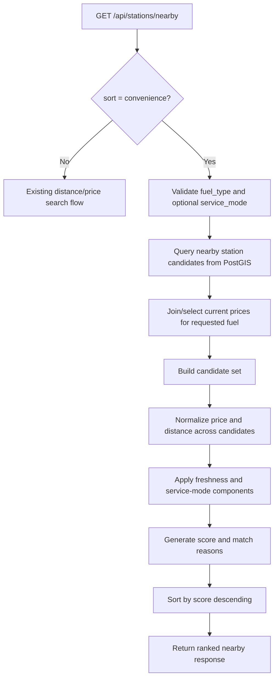

# PienoSmart Recommendation Score V1

## Purpose

This document defines the first recommendation-oriented ranking behavior for PienoSmart.

The goal is to move the product from:

- "show nearby stations"

to:

- "help the user make the best refueling decision"

This is the design reference for the next backend branch:

- `feat/recommendation-score-v1`

It is intentionally practical. It defines:

- the user-facing use case
- the MVP scoring scope
- the API changes
- the implementation approach
- the flow between search, scoring, and response composition

## Why This Comes Next

The current backend already supports:

- MIMIT ingestion
- current station and price storage
- nearby station search
- station detail retrieval
- freshness metadata

What is still missing is the product-specific ranking logic that makes PienoSmart different from a plain station finder.

Recommendation Score V1 is the first step toward that differentiation.

## Product Use Case

### Core User Question

"Given where I am and what I need to refuel, which station is the most convenient choice right now?"

### MVP Interpretation

For MVP, "best" should not try to be fully personalized yet.

It should mean:

- nearby enough to be practical
- priced competitively for the requested fuel
- based on fresh enough data
- aligned with the requested service mode when provided

### Example User Flows

1. A user near Caserta wants diesel `self` and wants the best practical option nearby.
2. A user does not care about the absolute cheapest price if the station is much farther away.
3. A user should not be pushed toward stale or missing price data when fresher alternatives exist.

## Scope For V1

### In Scope

- add `sort=convenience` to `GET /api/stations/nearby`
- rank nearby stations with a deterministic score
- require or strongly prefer a `fuel_type` when using convenience sorting
- optionally use `service_mode` as an explicit preference
- return:
  - `score`
  - `match_reasons`
  - enough response metadata to explain why a station ranked where it did

### Out Of Scope

- route-aware ranking
- toll or detour cost
- fuel tank economics
- user profile CRUD
- driving style personalization
- traffic-aware weighting
- predictive price change behavior
- ML or black-box scoring

## API Impact

## Endpoint

Use the existing nearby search endpoint:

- `GET /api/stations/nearby`

### Query Parameters

Existing:

- `lat`
- `lon`
- `radius_meters`
- `fuel_type`
- `service_mode`
- `brand`
- `limit`

Extend:

- `sort=convenience`

Optional later:

- `vehicle_profile_id`

### Recommended V1 Rule

If `sort=convenience` is requested:

- `fuel_type` should be required
- `service_mode` remains optional

Reason:

- a convenience score without a target fuel is too ambiguous for MVP
- otherwise the backend is forced to rank stations against mixed price rows that do not reflect a real refueling intent

## Response Additions

Extend nearby response items with:

- `score: float | null`
- `match_reasons: list[str]`

When `sort != convenience`:

- `score` can be `null`
- `match_reasons` can be an empty list

When `sort = convenience`:

- `score` should always be populated
- `match_reasons` should explain the most relevant positive or negative drivers

## Recommended Nearby Item Shape

```json
{
  "id": 11110,
  "ministerial_station_id": "15629",
  "name": "AREA DI SERVIZIO Q8 RECALE",
  "brand": "Q8",
  "address": "VIA CIMITERO 81026",
  "comune": "RECALE",
  "provincia": "CE",
  "postal_code": "81026",
  "is_highway_station": false,
  "latitude": 41.05101245700886,
  "longitude": 14.307212680578232,
  "distance_meters": 924.09,
  "selected_fuel_type": "diesel",
  "selected_service_mode": "self",
  "current_price": "1.699",
  "price_effective_at": "2026-04-27T22:52:12Z",
  "source_updated_at": "2026-04-28T06:00:00Z",
  "freshness_status": "fresh",
  "score": 83.4,
  "match_reasons": [
    "competitive price nearby",
    "matches requested self service",
    "fresh price data"
  ]
}
```

## Scoring Strategy

## Design Principles

The V1 score should be:

- deterministic
- explainable
- stable
- cheap to compute
- easy to tune

It should not try to be perfect. It should be good enough to support ranking and explanation.

## Inputs

For each candidate station, V1 should consider:

- distance from search point
- current price for the requested `fuel_type`
- service mode match or mismatch
- freshness status

### Required Input

- `fuel_type`

### Optional Input

- `service_mode`

### Ignored For V1

- brand preference
- station amenities
- route direction
- user favorites
- vehicle autonomy

## Candidate Set

The recommendation layer should not search the whole database directly.

It should rank the already filtered nearby candidate set:

1. retrieve nearby candidates from PostGIS
2. select the relevant current price row for the requested fuel
3. compute score per candidate
4. sort by score descending
5. return ranked results

## Recommended V1 Formula

Use a 0-100 style score assembled from weighted components.

Suggested structure:

```text
score =
  price_component
  + distance_component
  + freshness_component
  + service_mode_component
```

### Price Component

Price should be evaluated relative to the candidate set, not with a hardcoded national threshold.

Recommended approach:

1. compute `min_price` and `max_price` across scored candidates
2. normalize each candidate price within that range
3. better price gets higher score

Example weight:

- max `45` points

Example behavior:

- cheapest candidate gets close to `45`
- most expensive candidate gets close to `0`

If all candidates have the same price:

- assign a neutral value such as `30`

### Distance Component

Closer stations should score better, but distance should not dominate price completely.

Recommended approach:

- normalize candidate distance relative to requested `radius_meters`

Example weight:

- max `30` points

Example behavior:

- very close stations get near `30`
- stations near the radius edge get near `0`

### Freshness Component

Freshness should reward reliable data and penalize stale or unknown price state.

Recommended values:

- `fresh`: `+15`
- `stale`: `+5`
- `unknown`: `0`

This keeps freshness important without making it dominate price and distance.

### Service Mode Component

If `service_mode` is requested:

- exact match: `+10`
- non-match: `0`

If no `service_mode` is requested:

- neutral `+0`

V1 should not apply a negative penalty for non-match if the query already filtered service mode strictly.

## Reason Generation

Each scored result should also produce explanation reasons.

This is not just UX polish. It is part of the product promise of transparent convenience ranking.

### Suggested Reason Rules

Add reasons when conditions apply:

- low price relative to nearby options:
  - `"competitive price nearby"`
- top-tier distance:
  - `"very close to your location"`
- service mode matched:
  - `"matches requested self service"`
  - `"matches requested serviced fuel"`
- fresh data:
  - `"fresh price data"`
- stale data:
  - `"price data may be outdated"`

Keep the list short:

- maximum 2-3 reasons per item

## Data Requirements

Recommendation V1 depends on:

- `stations.location`
- `current_prices`
- `current_prices.price`
- `current_prices.fuel_type`
- `current_prices.service_mode`
- `current_prices.source_updated_at`

It does not require any schema change if score is computed at request time.

## Implementation Plan

## Suggested Modules

Add a dedicated recommendation package:

- `backend/app/recommendation/scoring.py`
- `backend/app/recommendation/models.py`

Existing modules to update:

- `backend/app/catalog/schemas.py`
- `backend/app/catalog/service.py`
- `backend/app/api/routes/stations.py`

## Recommended Responsibilities

### `catalog/service.py`

Should:

- retrieve nearby station candidates
- select the current price row relevant to the requested fuel/service context
- return raw candidate objects or typed internal DTOs

Should not:

- own scoring formulas directly

### `recommendation/scoring.py`

Should:

- compute normalized score components
- generate `match_reasons`
- rank candidates

This separation keeps search and recommendation concerns distinct.

## Suggested Internal Flow

1. parse nearby query
2. validate `sort=convenience` requirements
3. fetch nearby candidates with current price rows for requested fuel
4. discard candidates with no price for requested fuel
5. compute score components across candidate set
6. attach `score` and `match_reasons`
7. sort by score descending
8. return typed API response

## Mermaid Flow



## Validation Rules

### Request Validation

If `sort=convenience` and `fuel_type` is missing:

- return `422`

This is preferable to returning a misleading ranking.

### Candidate Eligibility

For V1 recommendation ranking:

- exclude stations with no current price for the requested `fuel_type`

Reason:

- recommendation needs a comparable price basis
- stations without comparable price data can still appear in plain distance search, but not in convenience ranking

## Testing Strategy

## Unit Tests

Add focused tests for:

- price normalization
- distance normalization
- equal-price edge case
- empty candidate set
- freshness scoring
- service mode matching
- reason generation

Suggested file:

- `backend/tests/test_recommendation_scoring.py`

## API Tests

Extend station nearby API coverage with:

- `sort=convenience` with valid `fuel_type`
- convenience ranking order with controlled fixtures
- `422` when convenience sort is requested without `fuel_type`
- exclusion of stations missing requested fuel price
- explanation fields present in response

Suggested file:

- extend `backend/tests/test_stations_nearby_api.py`

## Acceptance Criteria

Recommendation Score V1 is complete when:

- `GET /api/stations/nearby?sort=convenience&fuel_type=...` works end-to-end
- results are ranked by deterministic score
- each ranked result includes `score`
- each ranked result includes explanation reasons
- stations without comparable requested-fuel price are excluded from convenience mode
- the API returns `422` when convenience ranking is requested without `fuel_type`
- unit and DB-backed API tests cover the new behavior

## Suggested Branch Plan

Branch:

- `feat/recommendation-score-v1`

Recommended implementation order:

1. add recommendation internal models
2. implement scoring function
3. extend nearby query validation for `sort=convenience`
4. wire scoring into nearby response assembly
5. add tests
6. review and tune weights against live local data

## Follow-Up After V1

After Recommendation Score V1, the next most logical additions are:

1. vehicle profile CRUD
2. profile-aware recommendation weighting
3. favorites
4. route-based recommendation

That sequence keeps the system simple while moving steadily toward the product promise.
